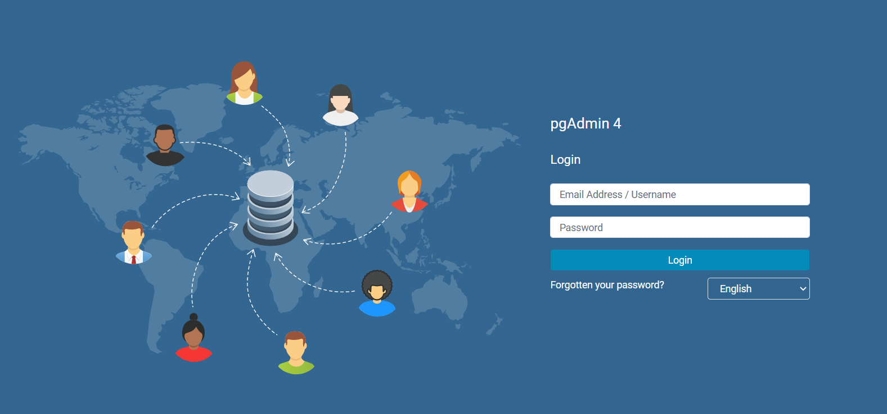
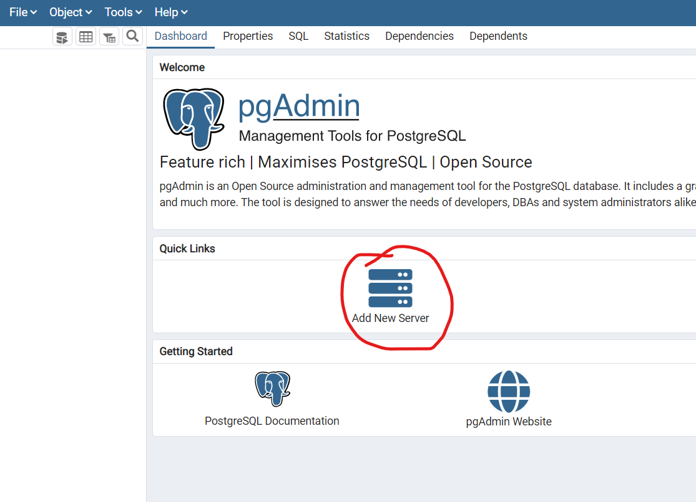
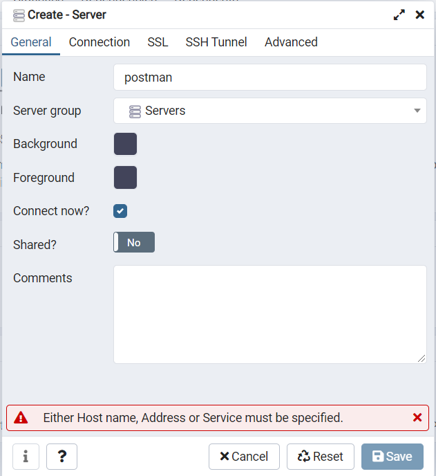
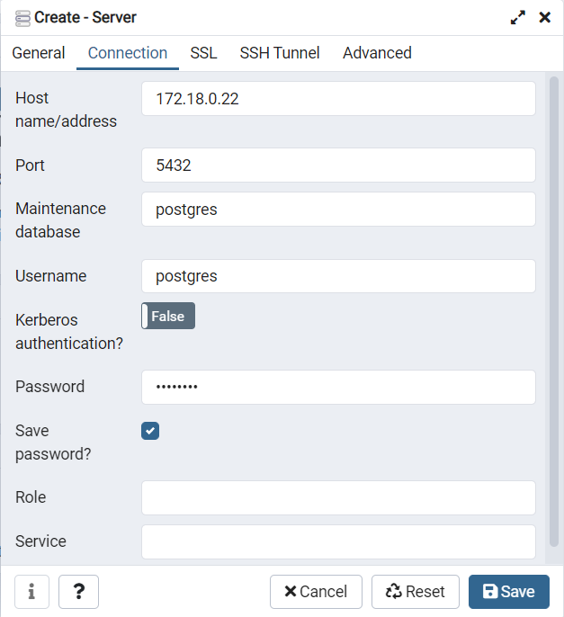

# Postman Assignment
 Assignment for data engineer role at Postman India,
 
##Table of content


## Introduction
The instruction given in the assignment was to build a non-blocking parallel processing ETL pipeline that would ingest
data from a .csv file, process the data and load to a database table, following which the the data from the products
table needs to be aggregated and further inserted into another table. I have used **spark**, with scripts written in 
pyspark, as my ETL tool and have used PostGres as the target database.  

Following were the points to achieve
- Code should follow concept of OOPS
- Support for regular non-blocking parallel ingestion of the given file into a table. Consider thinking about the scale 
  of what should happen if the file is to be processed in 2 mins.
- Support for updating existing products in the table based on `sku` as the primary key.
- All product details are to be ingested into a single table
- An aggregated table on above rows with `name` and `no. of products` as the columns

Assumptions made during the development of the ETL framework are as follows :
- No column was provided with input data in products.csv that would allow one to identify the latest update record for a
  particular `sku` value, thus a `request_id` column has been derived in spark, which is a concatenation of timestamp 
  and row number. The assumption that is made that every data that is input would natively have its own timestamp based 
  on which you can filter out only the latest values.
- One of the other assumptions or inferences that has been made is that it's been expected that update should happen on
target table treating `sku` like a primary key i.e only one record of a `sku` value can exist, but this does not 
  necessarily imply that column `sku` should be made the primary key in the table
  
##Folder Structure
### A typical top-level directory layout

    .
    ├── configs                 # config files
    ├── dependencies            # shared dependency libraries
    ├── jobs                    # contains the main pyspark ETL script/job
    ├── source_data             # contains the products.csv file
    ├── code.zip                # zip of dependencies folder
    ├── images                  # images for README.md
    ├── LICENSE           
    └── README.md

## Steps to run the code
There are three containers in total that host the whole framework on docker. Each for spark, postgresql and pgadmin4.
###Requirements: 
- Docker
- Docker Compose
- Git

1. Clone the code base from this github repo using command


  ```
  git clone https://github.com/pradeeppaikateel/postman-assignment.git 
  ```
2. Change directory to folder `postman-assignment`
```
cd postman-assignment
```
**NOTE: All commands in cmd/terminal are to be run from this directory**

As this framework is built in a windows machine, I have created a batch file that would execute all initial commands.

3. Execute the following command to run the batch file in windows cmd
```
new.bat
```
the batch file contains the following commands that can be run individually **if needed**
```
docker build -t pradeep/spark -f Dockerfile .
docker build -t pradeep/pgadmin4 -f Dockerfile2 .
docker network inspect develop >$null 2>&1 || docker network create --subnet=172.18.0.0/16 develop
docker start postgres > $null 2>&1 || docker run --name postgres --restart unless-stopped -e POSTGRES_PASSWORD=postgres --net=develop --ip 172.18.0.22 -e PGDATA=/var/lib/postgresql/data/pgdata -v /opt/postgres:/var/lib/postgresql/data -p 5432:5432 -d postgres:11
docker-compose up -d
docker run -p 5050:80 --volume=pgadmin4:/var/lib/pgadmin -e PGADMIN_DEFAULT_EMAIL=postman@sample.com -e PGADMIN_SERVER_JSON_FILE=/pgadmin4/servers.json -e PGADMIN_DEFAULT_PASSWORD=postman --name="pgadmin4" --hostname="pgadmin4" --network="develop" --detach pradeep/pgadmin4
```
4. Once the above commands are successful , the command given below can be used to submit the pyspark script to trigger the ETL job from local windows machine cmd
```
docker exec spark-master spark-submit --master spark://spark:7077 --py-files /opt/bitnami/spark/postman-assignment/code.zip /opt/bitnami/spark/postman-assignment/jobs/etl_job.py --source=PRODUCTS --env=dev --job_run_date=2021-08-07T02:00:00+00:00
```

## Framework Functionality
This spark framework offers the following functionality which covers all the 'points to achieve' as following:
- The framework has been created following OOPS concept and every process is set up as an object like Extract, Transform, Load etc, where each objects has its own methods.
- the data is repartitioned to a number of 200, which would ensure that non-blocking parallel procession ensures even as the cluster resources scale up.
- Loading of data into the target table happens using the Upsert functionality treating `sku` as the conflict key, wherein if a record with said `sku` does not exist then it is inserted into target table, and if it does then the other columns are updated.
- All product details are ingested to a single table called as products in database postman.
- An aggregate ETL process is also run wherein the data is taken from the products table , aggregated and inserted into products_agg table of database postman
- Truncation of data does not happen in any of the loading process
- A logger module is implemented which keeps a log of the ETL process (details given later)
- Error handling has been implmented to raise meaningful errors
- A data sanity check is done at the beginning after the extract phase, where a check is done on the count of records (count of records should be greater than 0), and the rows are checked null values in any of the source columns. If null values are found , it is filtered out and loaded into a csv file to be inspected by developer/support 
- The target table(products) records are also inserted with a `record checksum` ,`update timestamp`, `p id` and `request id` so that the data available in products table can be used by other processes with ease


Everything has been achived from the 'points to achieve', there were instructions to include support for updating the products table based on `sku` as the primary key, sku has not been made the primary key as its always better to have a numeric as a primary key for ease of querying records and faster performance when dealing with upcoming huge future data. The workaround for this was to generate a surrogate key using zipwithuniqueid() function of rdd to generate surrogate values that do not have a chance of collision as the data scales.


Once the spark job is executed the logs can be seen with the following command
```
docker exec spark-master more /opt/bitnami/spark/logs/spark.txt
```

If error records are found then they are written to the following location
```
/opt/bitnami/spark/postman-assignment/error_records/error_records.csv
```

##Postgres Details

Two tables are created/used , the `products` table and `products_agg` table

products table:
```
CREATE TABLE IF NOT EXISTS public.products( 
p_id bigint primary key,
sku varchar(70) unique not null,
name varchar(70) not null,
description varchar(300) not null,
request_id varchar(40),
record_checksum varchar(45) not null,
updt_tmstmp TIMESTAMP DEFAULT CURRENT_TIMESTAMP
)
```
products_agg table:
```
CREATE TABLE IF NOT EXISTS products_agg( 
p_id bigint primary key,
name varchar(70) unique not null,
"no. of products" integer not null,
updt_tmstmp TIMESTAMP DEFAULT CURRENT_TIMESTAMP
) 
```

Details on how to connect to the Postgres server using pgadmin is given below:

1. Go to a browser and connect to :
```
http://localhost:5050/
```
2. Enter email and password as :
```
emailid: postman@sample.com
password: postman
```

3. Once logged in, connect to new server with following details:
```
"name": postman
"user": postgres,
"password": postgres,
"host": 172.18.0.22,
"port": 5432,
```




